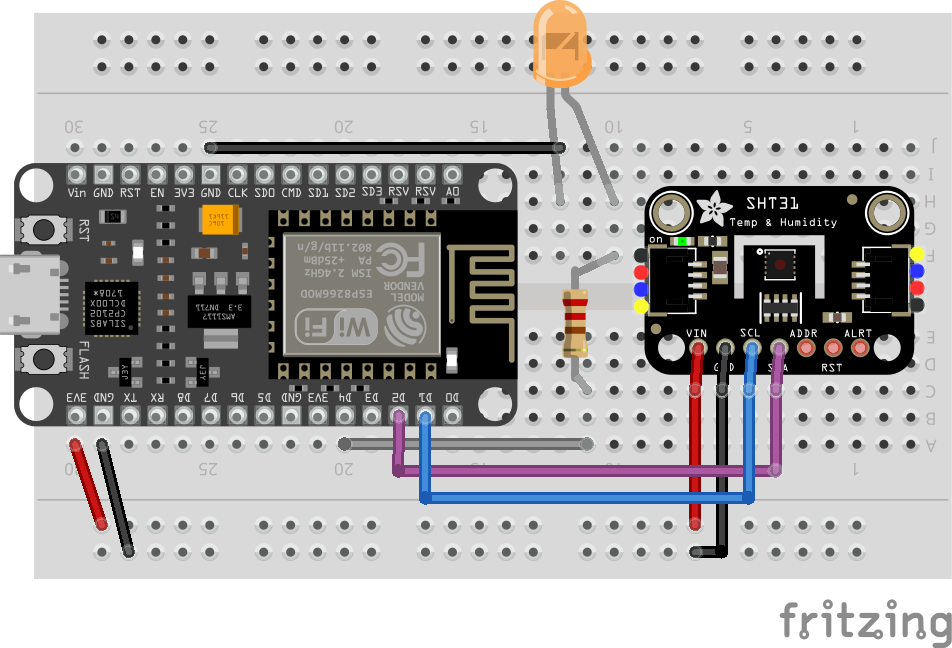
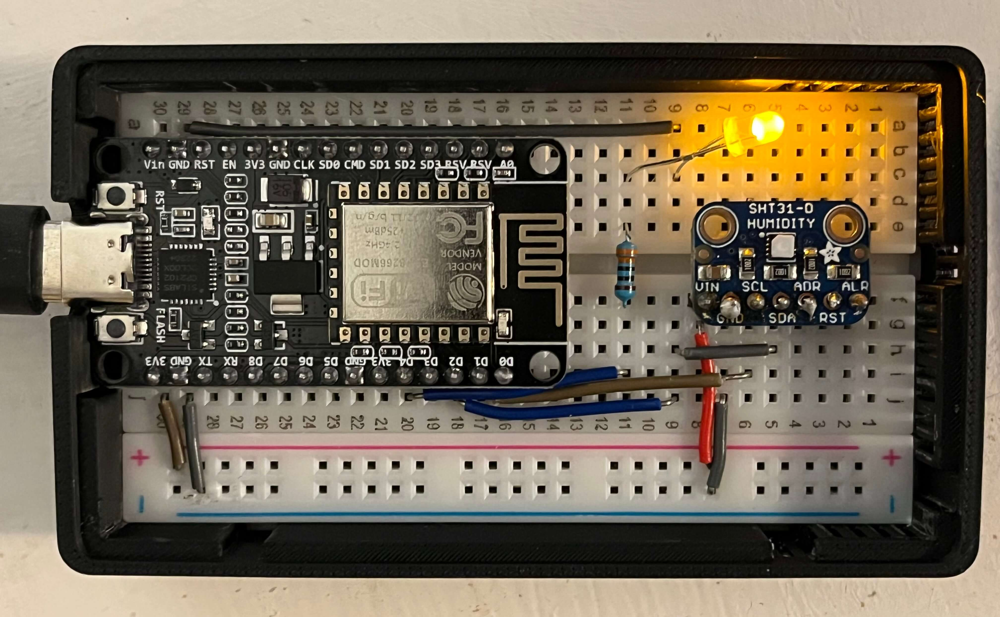
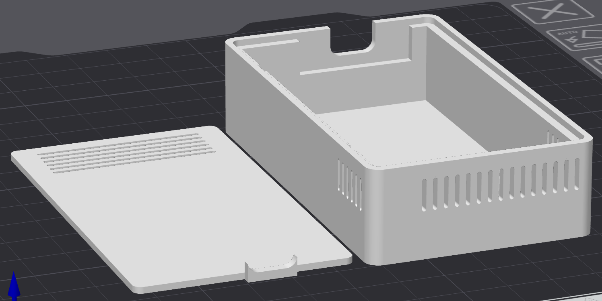
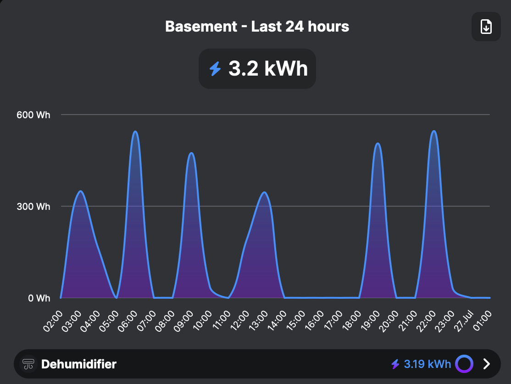

# ESP8266 Powered Smart-Dehumidifier

Controlling a standard dehumidifier wirelessly with a humidity sensor and
NodeMCU/ ESP8266. This general premise can be used as a template for any sensor/
appliance combo.

**==== Make sure your dehumidifier is compatible ====**

Your dehumidifier must have **"auto-resume" functionality** to work with this
project. This means:

- [x] **When plugged in** → Dehumidifier automatically turns ON
- [x] **When unplugged** → Dehumidifier turns OFF (obviously)
- [x] **When plugged back in** → Dehumidifier automatically turns ON again

### Testing Your Dehumidifier

1. Turn on your dehumidifier manually
2. Unplug it from the wall
3. Wait a few seconds
4. Plug it back in

**If the dehumidifier starts running immediately without pressing any buttons**,
it's compatible!

**If you have to press the power button again**, this project won't work with
your dehumidifier (unless you want to get fancy but that's out of this scope).

### Why This Matters

This project controls power to the entire dehumidifier using a smart plug. We
can't press physical buttons remotely (without getting fancy), so the
dehumidifier must automatically resume operation when power is restored.

## Circuit Materials & Assembly

- NodeMCU (basically a cheap arduino with a wifi module)
- Adafruit SHT31-D Temp & Humidity Sensor (others will work, just switch out the
  library)
- 400 pin breadboard
- LED and compatible resistor (optional, turns on and off when the plug does)

Note: I only used materials I already had. Will other things work? Very probably
yes, although you may need to make some slight tweaks. If I didn't already have
a spare NodeMCU lying around, I probably would have used a Raspberry Pi Pico W,
so do with that what you will.

### Wiring Instructions

The humidity sensor communicates via I2C:

- **SCL** → D1 (clock)
- **SDA** → D2 (data)

The LED is connected to the resistor through D4.



### 3D Printed Case

**This case will only fit if the NodeMCU is placed in the center and the right
power rail is removed as pictured below.**



A slicer `.3mf` and raw `.step` version of the model are included in the
[3D Printed Case directory](/3D%20Printed%20Case/). The lid is optional but does
include ventilation.



It's a tight fit around the breadboard once cooled so I recommend snapping it in
there while it's still a bit warm. This is a bit annoying initially, but the
friction fit enables it to safely hang upside down with a command strip.

## Smart Plug

Initially, I planned to use IFTTT webhooks to trigger my smart plug. When I
realized I'd have to pay $36 a year for something I was sure could be free, I
pivoted to finding a solution that did not require a third party cloud service.

The solution, which I'm quite pleased with so far, turned out to be Shelly smart
plugs\*. These host a local webserver onboard and can be triggered over your
local network via http POST requests (or bluetooth if you so choose). As a
bonus, each plug keeps track of its power consumption and an optional cloud
service is available if you ever wanted to use it like a 'standard' smart plug
on your phone with their app.



I am using the
[Shelly Plus Plug](https://us.shelly.com/products/shelly-plus-plug-us?srsltid=AfmBOorMOhmX6oqy4EGzmv9hvLMr3w0otFUSKGUv5Gh2UUnPvT38l6vM),
although their other relays would work the same way.

While more hacky options are available,
[Shelly plugs are well documented](https://shelly.guide/webhooks-https-requests/).
If you're using a different solution, make sure the POST requests are changed
accordingly.

\*I'm not sponsored I'm just a nerd who appreciates a good ~~toy~~ product.

### Shelly Plug Config

Once the plug is up and ready you can use the web interface to tweak the
settings.

- Make sure to set a static IP for the plug so you don't need to reprogram the
  ESP8266.
- You can disable the AP and bluetooth.
- I like using the cloud services but you don't need them (either).

## Program Setup

### Arduino IDE Setup

The ESP8266 chip needs to be added to the Arduino IDE before it can be flashed.
[Here's a guide](https://randomnerdtutorials.com/how-to-install-esp8266-board-arduino-ide/).

You'll also need to install the _Adafruit SHT31 Library_ for the sensor through
the library manager. The example sketch is helpful for testing the circuit and
measuring humidity through serial.

For further testing (but mostly fun), you can add the LED logic to turn on/off
at a single high threshold and gently exhale on the sensor it to increase the
humidity until the light turns on.

### Adjusting Parameters

In the main program file, adjust these values based on your needs. This setup is
optimized for my basement to keep it down to at least 50% relative humidity.

```C++
const float HIGH_HUMIDITY_THRESHOLD = 50.0;       // % - Turn ON dehumidifier
const float LOW_HUMIDITY_THRESHOLD = 45.0;        // % - Turn OFF dehumidifier
const unsigned long MEASUREMENT_INTERVAL = 30000; // 30 seconds between readings
```

Make sure to leave enough room so that the dehumidifier isn't constantly turning
on and off due to small fluctuations. 5% - 10% relative humidity between
thresholds works great.

The Adafruit SHT31-D sensor has a heater that can be triggered in high humidity
to prevent condensation. I have somewhat arbitrarily set it to cycle on for two
seconds every five minutes when the % RH is above 95.

```C++
const float CRITICAL_HUMIDITY_THRESHOLD = 95.0;  // % - Activates sensor heater
const unsigned long SENSOR_HEAT_INTERVAL = 300000;    // 5 minutes between heater cycles
const unsigned long SENSOR_HEAT_DURATION = 2000;      // 2 seconds heater duration
```
